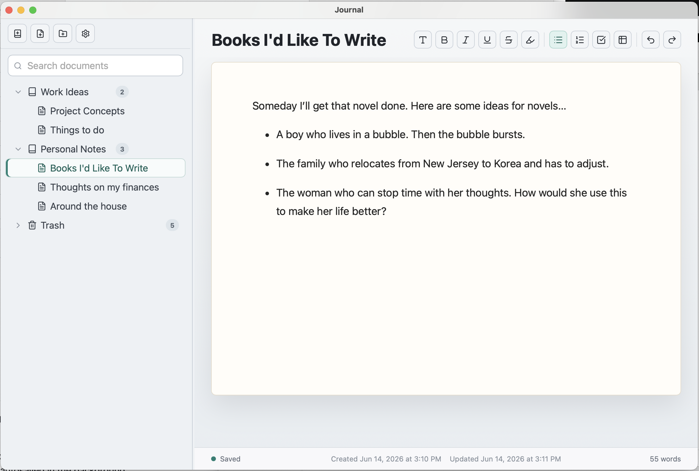

<p align="center">
  
</p>

<h1 align="center">Journal</h1>

Journal is a local desktop writing application that just lets you write and organize your documents they way you want. No need to deal with individual files on the filesystem, Journal manages your documents virtually in a database. It also autosaves your work as you write, so you never lose a word. 

<p align="center">
  
</p>

## Current Features

- SQLite-backed document and folder library
- Editable document titles
- Tiptap rich-text editor with headings, formatting, lists, tasks, tables, autolinking, highlights, and word count
- Automatic draft persistence through the Go backend
- Folder and document creation, rename, move, and delete
- Trash folder with permanent delete behavior for items already in Trash
- Drag and drop into folders or back to the top level
- Full-text search across folder titles, document titles, and saved document body text using SQLite FTS
- Configurable autosave interval in the app UI

## Requirements

- Go 1.23 or newer
- Node.js and npm
- Wails v2 CLI

Linux builds should be produced on Linux with the Wails WebKitGTK dependencies installed.

## Development

Journal is built with Wails, Go, React, TypeScript, Tiptap, ProseMirror, and SQLite. Documents are saved as ProseMirror JSON.

### Install frontend dependencies:

```sh
cd frontend
npm install
```

### Run the app in Wails development mode:

```sh
wails dev
```

### Run backend tests:

```sh
go test ./...
```

### Build the frontend only:

```sh
cd frontend
npm run build
```

### Build the desktop application:

```sh
wails build
```

On macOS, the packaged app is written to:

```text
build/bin/Journal.app
```

## Versioning and Release Builds

The application version is controlled in one place:

```json
"info": {
  "productVersion": "1.0.0"
}
```

Update `info.productVersion` in `wails.json` before making a release. Wails uses this value for the macOS bundle metadata and Windows executable metadata. The build scripts also pass the same value into the Go binary so the About window reports the release version.

### Build a release macOS app:

```sh
scripts/build-macos.sh
```

### Build a release Windows executable:

```sh
scripts/build-windows.sh
```

### Build a release Windows installer:

```sh
NSIS=1 scripts/build-windows.sh
```

### Build both release targets:

```sh
scripts/build-release.sh
```

### Build a Windows 64-bit executable:

```sh
wails build -platform windows/amd64
```

The Windows executable is written to:

```text
build/bin/Journal.exe
```

### To build a Windows installer, add the NSIS flag:

```sh
wails build -platform windows/amd64 -nsis
```

## Standalone macOS Build for Apple Silicon

### Build a standalone macOS app bundle for Apple Silicon Macs from the repository root:

```sh
scripts/build-macos.sh
```

### This builds the React frontend, embeds it in the Go/Wails application, and writes the macOS app bundle to:

```text
build/bin/Journal.app
```

### Run it from Finder, or from Terminal:

```sh
open build/bin/Journal.app
```

The actual executable inside the bundle is:

```text
build/bin/Journal.app/Contents/MacOS/Journal
```

To install the app locally, copy `build/bin/Journal.app` into `/Applications`.

## Data Storage

By default, Journal stores its SQLite database under the operating system user config directory:

```text
<user-config-dir>/Journal/journal.db
```

On macOS, this is typically:

```text
/Users/<your-user>/Library/Application Support/Journal/journal.db
```

On Windows, this is typically:

```text
C:\Users\<your-user>\AppData\Roaming\Journal\journal.db
```

For development or tests, set `JOURNAL_DB_PATH` to use a specific database file:

```sh
JOURNAL_DB_PATH=/tmp/journal-dev.db wails dev
```

The database file and SQLite sidecar files are intentionally ignored by Git.

### Generate a stress-test SQLite database:

It can be useful to create a mock database with lots of journals, folders and documents for testing purposes.

```sh
go run ./cmd/stressdb -out /tmp/journal-stress.db -journals 5 -min-folders 50 -max-folders 100 -nested-percent 40 -min-documents 500 -max-documents 1000 -min-words 200 -max-words 1000
```

The generator writes the same `items`, `documents`, `library_search_fts`, and `app_settings` schema used by Journal. Use `-overwrite` to replace an existing output file. Useful profiles:

```sh
# Many large documents
go run ./cmd/stressdb -out /tmp/journal-large-docs.db -journals 2 -min-documents 100 -max-documents 100 -min-words 10000 -max-words 25000 -overwrite

# Folder-heavy nested library
go run ./cmd/stressdb -out /tmp/journal-folders.db -journals 1 -min-folders 10000 -max-folders 10000 -nested-percent 80 -min-documents 10 -max-documents 10 -overwrite
```

## Verification

The current implementation has been verified with:

```sh
go test ./...
cd frontend && npm run build
wails build
```
